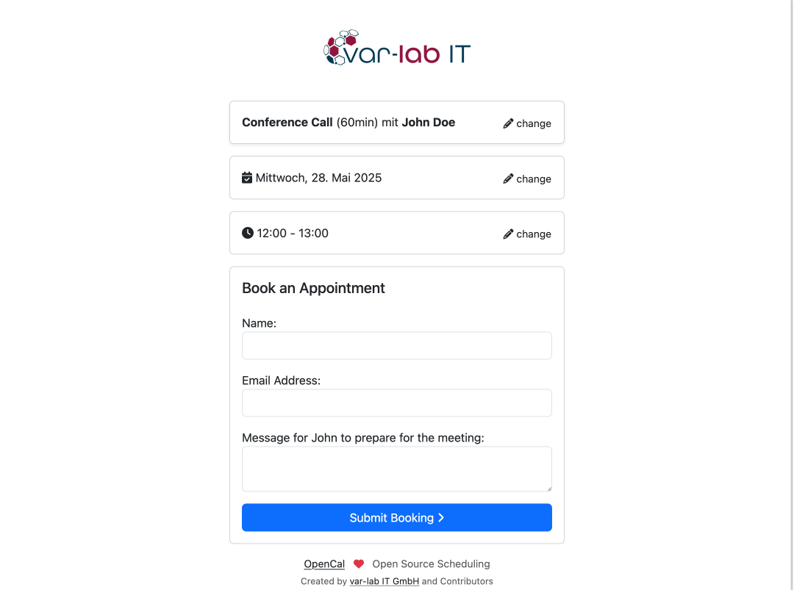

# OpenCal Web Frontend - Open Source Appointment Scheduling Platform

**OpenCal** is a modern, open-source web application that simplifies and streamlines the process of scheduling
appointments.
It’s ideal for anyone who organizes meetings and wants to save time, whether they are self-employed, part of a
team or employed by a company.
Due to its open license, OpenCal can be used, customized, and self-hosted free of charge. It is also suitable for
professional and commercial use in businesses.

This is the web-frontend repository for OpenCal, created with vue.js+vite. It can be used by everyone who don't want to
create his own frontend.

- [OpenCal Backend-API](https://github.com/var-lab-it/opencal)
- [Local development environment](https://github.com/var-lab-it/opencal-dev)

OpenCal is licensed under the [GNU AGPLv3 License](LICENSE).

Created by [var-lab IT GmbH](https://var-lab.com) (from Nuremberg, Germany) and contributors.
